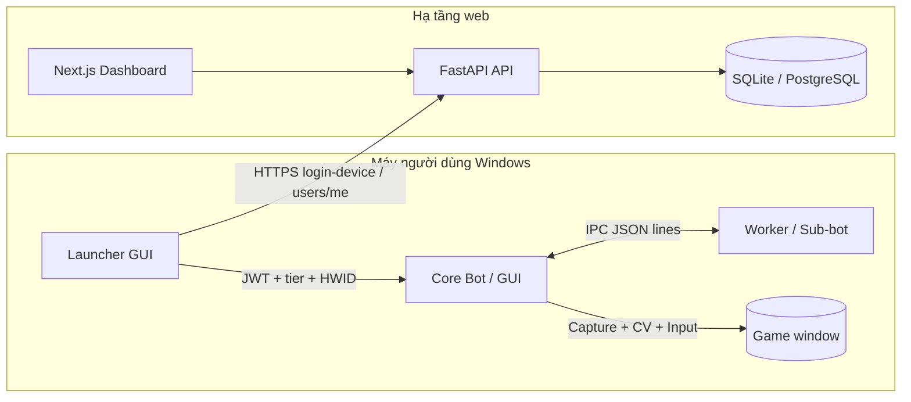
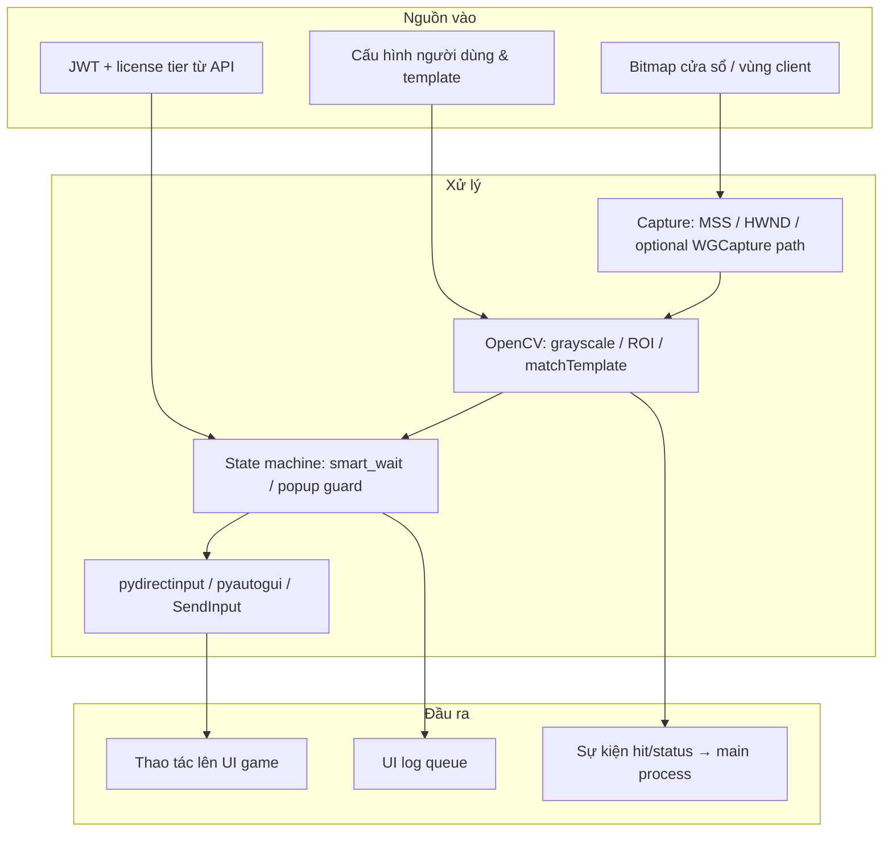
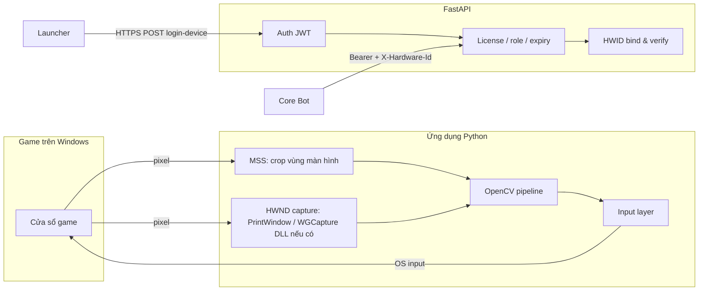

# AutoLastWar — Hệ thống tự động hóa & kinh doanh phần mềm (Commercial)

> **Repository portfolio:** [github.com/EthanNguyen1412/AutoLastWar](https://github.com/EthanNguyen1412/AutoLastWar)  
> Đây là **bản README dành cho nhà tuyển dụng / phỏng vấn**: mô tả bài toán, kiến trúc và kết quả. **Mã nguồn đầy đủ không được public** vì đặc thù sản phẩm thương mại.

---

## 1. Tóm tắt dự án

**AutoLastWar** là nền tảng kết hợp:

- **Ứng dụng Windows (Python)** — tự động hóa thao tác người dùng trên game strategy/mobile-port PC, dựa trên **Computer Vision (OpenCV)** và **chụp màn hình**, không đọc/ghi bộ nhớ tiến trình game.
- **Backend FastAPI** — xác thực, phân quyền, **license & gói VIP**, ràng buộc **một tài khoản — một máy (HWID)**.
- **Frontend Next.js** — dashboard người dùng, thanh toán/wallet (theo thiết kế hệ thống).

Mục tiêu kinh doanh: cung cấp công cụ tiết kiệm thời gian cho người chơi, đồng thời kiểm soát bản quyền và vận hành bền vững.

---

## 2. Mô tả bài toán

### 2.1. Ngữ cảnh

Game có UI phức tạp, nhiều popup, độ trễ mạng và thay đổi giao diện theo sự kiện. Người chơi cần **lặp lại thao tác** trong thời gian dài. Bài toán kỹ thuật là xây dựng bot **ổn định**, **ít can thiệp hệ thống**, có **phân tầng free/VIP** và **định danh thiết bị** để tránh chia sẻ license trái phép.

### 2.2. Yêu cầu chức năng (rút gọn)

| Nhóm | Nội dung |
|------|----------|
| Nhận diện UI | Template matching theo vùng (ROI), đa ngôn ngữ template, hiệu chỉnh theo tỉ lệ cửa sổ |
| Điều khiển | Click, kéo, phím tắt — ưu tiên lớp input tương thích DirectX/Windows |
| Độ tin cậy | Chờ có timeout, thoát kẹt popup, guard khi logout / màn hình bất thường |
| Vận hành | Logging không block UI, worker/sub-bot tách tiến trình khi cần |
| Kinh doanh | Đăng nhập launcher → JWT → kiểm tra tier & hạn license → khởi chạy core |

---

## 3. Thách thức kỹ thuật & cách tiếp cận

### 3.1. “Anti-cheat” & giảm rủi ro vận hành

**Không** sử dụng hook kernel, inject DLL hay đọc RAM game — hướng tiếp cận là **UI automation**: quan sát pixel qua capture và gửi input giống người dùng. Điều này thay đổi hoàn toàn bề mặt tấn công so với cheat bộ nhớ: phạm vi là **OS-level input + screen read**.

Các biện pháp **vận hành an toàn & bền** (không tiết lộ “công thức” riêng):

- **Jitter & timing**: độ trễ sau thao tác có biên độ ngẫu nhiên nhỏ, tránh pattern đều đặn máy móc.
- **Ổn định khi lag**: vòng chờ có kiểm tra trạng thái; thoát popup / swipe nhẹ khi UI kẹt.
- **Capture đúng nguồn**: ưu tiên pipeline ít phụ thuộc “desktop compositor” khi game fullscreen/borderless — kết hợp nhiều backend capture (vùng cửa sổ, fallback).

> **Tuân thủ:** Người dùng cuối chịu trách nhiệm tuân thủ điều khoản game và pháp luật. Phần mềm được thiết kế như công cụ hỗ trợ thao tác UI, không quảng bá hành vi gian lận có chủ đích.

### 3.2. Tối ưu xử lý ảnh

- **ROI (Region of Interest)**: không chạy `matchTemplate` trên full frame khi chỉ cần một icon góc màn hình — giảm độ phức tạp từ \(O(W \times H)\) xuống vùng nhỏ.
- **Grayscale pipeline**: matching trên ảnh xám khi không cần màu; BGR/HSV chỉ khi logic yêu cầu (ví dụ mask màu).
- **Multi-scale template**: anchor calibration theo độ phân giải/DPI — resize template & ROI tham chiếu một lần sau khi đo scale.
- **Đường dẫn Unicode trên Windows**: đọc ảnh qua buffer + `imdecode` thay vì `imread` trực tiếp để tránh lỗi đường dẫn có dấu.

### 3.3. Kiến trúc tách lớp & IPC

- Bot chính có thể **spawn worker** phụ trách quét tín hiệu; giao tiếp **JSON dòng qua socket** (nhẹ, dễ debug) thay vì shared memory phức tạp.
- Hàng đợi log giới hạn kích thước để **không tràn RAM** khi chạy lâu.

### 3.4. Bảo mật & license (FastAPI)

- **bcrypt** + **JWT**; CORS theo allowlist; middleware **rate limit** + lọc request bất thường.
- **HWID**: login thiết bị cập nhật `hardware_id`; API `/users/me` kiểm tra header `X-Hardware-Id` — sai/thiếu → từ chối (trừ luồng web đặc biệt).
- Admin: tạo/gia hạn/khóa license, audit log (theo thiết kế backend).

---

## 4. Kiến trúc hệ thống & luồng công việc

### 4.1. Workflow tổng quan (Business + Runtime)



### 4.2. Sơ đồ luồng dữ liệu (Data Flow Diagram)



### 4.3. Component Diagram — Python ↔ Game ↔ Backend



**Giao tiếp chính:**

| Thành phần | Vai trò |
|------------|---------|
| **MSS** | Chụp nhanh vùng desktop mapped theo tọa độ client của HWND |
| **HWND / WGCapture** | Giảm phụ thuộc “desktop overlay”; một số game DirectX cần đường capture khác MSS |
| **OpenCV** | `matchTemplate` + `minMaxLoc`, resize template theo scale |
| **FastAPI** | Session định danh thiết bị + trạng thái license VIP |

---

## 5. Kết quả đạt được

| Chỉ số | Giá trị | Ghi chú |
|--------|---------|---------|
| Người dùng đăng ký | **186** | Tài khoản tạo trên hệ thống (launcher / dashboard) |
| Doanh thu (3 tháng đầu sau ra mắt) | **~8.000.000 VND** | Gồm doanh thu license/gói và phí dịch vụ hỗ trợ bên ngoài |
| MAU cao nhất (đỉnh trong giai đoạn trên) | **~48** | Ước tính theo lượt đăng nhập thiết bị hợp lệ / tháng |
| Phiên bản ổn định production | **2.1.x** | Dòng build đang phát hành cho người dùng |
| Độ trễ một vòng nhận diện (ROI + grayscale, PC tầm trung) | **~15–30 ms** | Một lần `matchTemplate` trên ROI đã cắt, không quét full frame |
| Session chạy liên tục dài nhất (ghi nhận) | **~74 giờ** | Bot + worker; giới hạn chủ yếu do bảo trì máy / cập nhật game |
| Tỉ lệ crash ước lượng | **< 1% / ~1000 giờ** | Theo log ứng dụng và feedback; phần lớn liên quan môi trường (driver, overlay) |

**Hiệu suất & thiết kế vận hành:**

- Giảm CPU nhờ **giới hạn ROI** và **ít bước scale** trên luồng quét tín hiệu (sub-bot).
- RAM ổn định nhờ **queue log có giới hạn** và tránh giữ buffer ảnh full HD khi không cần.

---

## 6. Công cụ & stack

| Lớp | Công nghệ |
|-----|-----------|
| Client | Python 3.10+, CustomTkinter, OpenCV, NumPy, MSS, pydirectinput, pyautogui, requests |
| Capture | MSS; HWND + ctypes; tùy chọn Windows Graphics Capture (DLL) |
| API | FastAPI, SQLAlchemy, JWT, bcrypt |
| Web | Next.js, Axios client tập trung, polling dashboard |
| Diagram | Mermaid trong README (hoặc export sang [draw.io](https://app.diagrams.net/) nếu cần bản vector cho slide) |

---

## 7. Code mẫu đã “sanitize” (phong cách & clean code)

Dưới đây là các đoạn **tổng quát hóa** — giữ cấu trúc thật của dự án nhưng **không lộ tham số game, template ID hay luồng nghiệp vụ nhạy cảm**.

### 7.1. IPC: biến sự kiện nội bộ thành dòng JSON (gọn, dễ mở rộng)

```python
# sanitized_ipc_example.py — pattern từ kiến trúc worker ↔ main
from __future__ import annotations

import json
from typing import Any, Dict, Optional, Tuple

def event_to_line(event: Tuple[Any, ...]) -> bytes:
    """Chuẩn hóa tuple sự kiện -> một dòng UTF-8 JSON."""
    kind = event[0]
    if kind == "hit" and len(event) >= 3:
        payload: Dict[str, Any] = {"k": "hit", "id": event[1], "score": float(event[2])}
    elif kind == "status":
        payload = {"k": "status", "code": event[1], "meta": event[2] if len(event) > 2 else None}
    elif kind == "error" and len(event) >= 2:
        payload = {"k": "error", "message": str(event[1])}
    else:
        payload = {"k": "unknown", "raw": list(event)}
    return (json.dumps(payload, ensure_ascii=False) + "\n").encode("utf-8")

def line_to_event(line: bytes) -> Optional[Dict[str, Any]]:
    if not line.strip():
        return None
    return json.loads(line.decode("utf-8"))
```

**Ý tưởng:** tách **protocol** khỏi **nghiệp vụ**; thêm field mới không phá binary layout.

### 7.2. Xử lý ảnh: đọc PNG an toàn trên Windows + ROI merge có kiểu

```python
# sanitized_image_helpers.py — pattern OpenCV + cấu hình người dùng
from __future__ import annotations

from pathlib import Path
from typing import Any, Dict, Tuple

import cv2
import numpy as np

def imread_unicode(path: Path, flags: int = cv2.IMREAD_GRAYSCALE) -> np.ndarray | None:
    """Tránh lỗi đường dẫn Unicode với cv2.imread trên Windows."""
    data = np.fromfile(str(path), dtype=np.uint8)
    if data.size == 0:
        return None
    img = cv2.imdecode(data, flags)
    return img

def merge_roi_presets(defaults: Dict[str, Tuple[int, int, int, int]], user: Any) -> Dict[str, Tuple[int, int, int, int]]:
    """Ghi đè ROI an toàn từ dict user; bỏ qua phần tử không hợp lệ."""
    out = dict(defaults)
    if not isinstance(user, dict):
        return out
    for key, val in user.items():
        if isinstance(val, (list, tuple)) and len(val) == 4:
            try:
                out[str(key).strip() or key] = tuple(int(x) for x in val)
            except (TypeError, ValueError):
                continue
    return out

def match_score(screen_gray: np.ndarray, tpl_gray: np.ndarray) -> float:
    """Một bước matching chuẩn hóa — ngưỡng quyết định nằm ở lớp gọi."""
    if screen_gray.shape[0] < tpl_gray.shape[0] or screen_gray.shape[1] < tpl_gray.shape[1]:
        return 0.0
    res = cv2.matchTemplate(screen_gray, tpl_gray, cv2.TM_CCOEFF_NORMED)
    return float(cv2.minMaxLoc(res)[1])
```

**Ý tưởng:** validate dữ liệu cấu hình sớm; hàm thuần **dễ unit test**; không nhúng magic number vào util.

### 7.3. Session API tối giản (launcher → backend)

```python
# sanitized_api_session.py — pattern requests + header HWID
from __future__ import annotations

import os
import requests

def fetch_entitlements(api_base: str, token: str, hardware_id: str, timeout: float = 10.0) -> dict:
    """Lấy thông tin user/tier — endpoint cụ thể được ẩn khỏi README."""
    url = os.environ.get("LICENSE_ME_URL", f"{api_base.rstrip('/')}/api/v1/users/me")
    headers = {
        "Authorization": f"Bearer {token}",
        "X-Hardware-Id": hardware_id,
    }
    r = requests.get(url, headers=headers, timeout=timeout)
    r.raise_for_status()
    return r.json()
```

---

## 8. Hướng phát triển

- SSE/WebSocket cho dashboard thay vì polling khi cần realtime.
- Chuẩn hóa PostgreSQL cho production; metric quan sát (queue depth, latency match).
- Bộ test tự động cho các primitive CV (golden images / snapshot regression).

---

## 9. Liên hệ & license

- **Repository portfolio:** [github.com/EthanNguyen1412/AutoLastWar](https://github.com/EthanNguyen1412/AutoLastWar)
- Mã nguồn đầy đủ **không có trong repo public**. CV / portfolio có thể bổ sung link demo video hoặc slide kiến trúc (không lộ secret).

---

*Tài liệu kỹ thuật nội bộ tham chiếu (không đính kèm trong repo public): `PROJECT_TECHNIQUES.md` trong workspace phát triển.*
